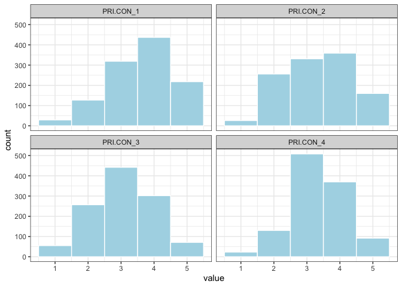
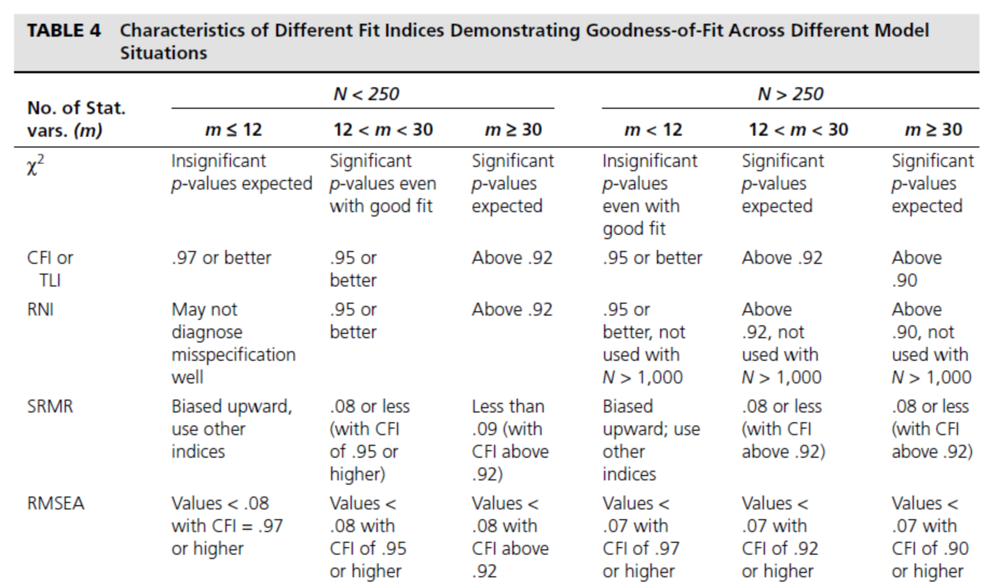
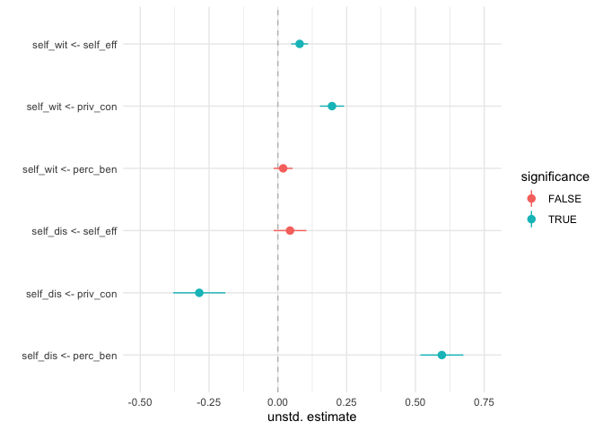

Structural equation modeling
================
Philipp Masur
2022-03

-   [Introduction](#introduction)
    -   [Basics](#basics)
    -   [Terminology and visual
        representation](#terminology-and-visual-representation)
-   [Preparation](#preparation)
    -   [Getting the data](#getting-the-data)
    -   [Explore the data](#explore-the-data)
-   [Structural equation modeling](#structural-equation-modeling)
    -   [Simple confirmatory factor
        analysis](#simple-confirmatory-factor-analysis)
    -   [Simple structural equation
        model](#simple-structural-equation-model)
    -   [Model from the paper](#model-from-the-paper)
    -   [Assessing fit](#assessing-fit)
-   [Reporting results](#reporting-results)
    -   [Inspecting individual paths](#inspecting-individual-paths)
    -   [Plotting results](#plotting-results)
-   [Where to go next?](#where-to-go-next)

# Introduction

This tutorial explains the basics of using the package `lavaan` (latent
variable analysis) to conduct structural equation modeling (SEM) with
latent variables. Although we will focus on SEM with latent variables,
`lavaan` can actually be used for a large variety of multivariate
statistical models including, path analysis, confirmatory factor
analysis, structural equation modeling, multi-group analyses, or growth
curve models. For more information have a look at the respective
[website](https://lavaan.ugent.be/).

## Basics

In a previous tutorial on [confirmatory factor
analysis](https://github.com/ccs-amsterdam/r-course-material/blob/master/tutorials/R_test-theory_1_cfa.md)
(CFA), I already explained why it is often useful to estimate a
“reflective measurement model” when we are interested in somewhat
“abstract” concepts (e.g., emotions, attitudes, concerns, personality…).
As these concept cannot be measured directly, we have to assess them
indirectly using observable indicators such as items in a questionnaire.
By using latent modeling, we can estimate these concepts with less
measurement error and thus estimate relationship between such concepts
with more accuracy.

Structural equation modeling is basically a combination of latent
measurement (as used in CFAs) and standard regressions modeling. We
first define our measurement models, i.e., how each item is explained by
a latent variable, and then model the relationships between these
measurement models. For example, as shown in Figure 1, we estimate
intelligence and academic performance based on different observable
indicator (e.g., scales, scores, etc.) and then estimate their
relationship (in this case b = .8).


*Figure 1*. Example of a structural equation model with latent
variables.

But structural equation modeling does not only allow to model bi-variate
relationship with more precision. We can model various relationships
between several variables:


*Figure 2.* Structural equation model with latent variables as estimated
by Krasnova et al., 2010.

## Terminology and visual representation

A SEM thus represents theoretically assumed relationships. Estimating a
SEM thus requires a better theoretical understanding and a priori
formulation of the relationships of interest. As introduced already
earlier, such models are often represent visually. For such
visualization, we need to follow certain rules (see Figure 3). We need
to distinguish latent vs. observed variables, unidirectional and
correlational paths, as well as various error representations:

 *Figure 3.* Typical
symbols used in path and structural equation models.

We further have to distinguish *endogeneous* and *exogeneous* variables.
Endogeneous variables are predicted by one or several other variables in
the model (e.g., academic performance in Figure 1). Exogeneous variables
are not predicted by any other variables in the model (e.g.,
intelligence in Figure 1).

In contrast to standard regression modeling, SEM allows us to estimate
all paths of a potentially infinitely complex model in one step. This is
done by creating regression equations for all endogeneous variables. The
combination of all equations is what we call the structural equation
system. I won’t go into the mathematical details here. For more
information, have a look at the book “Principles and Practice of
Structural Equation Modeling” by Rex Kline.

# Preparation

In this tutorial, we will estimate several structrural equation models
based on the data by Dienlin & Metzger 2016) collected responses from n
= 1,156 US American participants to test and extended versions of the
privacy calculus model.

To run structurual equation models, we only need the package `lavaan`.
Some further functions to evaluate SEMs are included in the package
`semTools`, which we will load as well.

But as we will have to wrangle the data bit and want to assess normality
in the data, we will also load the package collection `tidyverse` and
the package `psych`

``` r
# Data wrangling packages
library(tidyverse)
library(psych)

# Structural equation modeling packages
library(lavaan)
library(semTools)
```

## Getting the data

Dienlin and Metzger fortunately published the data on the Open Science
Framework (osf.io). The function `read.csv()` fortunately allows us to
load the data directly from the website.

``` r
d <- read.csv("https://osf.io/bu74a/download", header=TRUE, na.strings="NA") %>%
  as_tibble 

head(d)
```

As we can see, the data contains 60 variables and consists of 1156
observations.

## Explore the data

Let’s quickly explore the data and get a feel for the sample. Here, I am
simply summarizing some socio-demographics.

``` r
# Age 
describe(d$AGE)

# Gender
table(d$SEX) %>%
  prop.table

# Check variables
names(d)
```

The authors state that the sample is representative for the US.
Participants are on average M = 46.91 years old and 42.6% are female.

The data sets includes items that measured:

-   Perceived benefits of using Facebook (FB.BEN\*)
-   Perceived concerns (PRI.CON\*)
-   Privacy self-efficacy (FB.PRI.SEL.EFF\*)
-   Self-Disclosure (FB.DIS\*)
-   Withdrawal (FB.WIT\*)

# Structural equation modeling

## Simple confirmatory factor analysis

Technically speaking, a simple reflective measurement model already
represents a SEM. So let’s start simple and estimate a comparatively
simple CFA for the latent variable “privacy concerns”. Before we do so,
we should check whether the items are normally distributed and whether
the assumptions of multivariate normality is violated.

``` r
# Check normal distribution of individual items
d %>%
  select(PRI.CON_1:PRI.CON_4) %>%
  describe

# Inspect visually
d %>%
  select(PRI.CON_1:PRI.CON_4) %>%
  pivot_longer(PRI.CON_1:PRI.CON_4) %>%
  ggplot(aes(x = value)) +
  geom_histogram(bins = 5, color = "white", fill = "lightblue") +
  facet_wrap(~name, ncol = 2) +
  theme_bw()
```

<!-- -->

``` r
# Check multivariate normal distribution
d %>%
  select(PRI.CON_1:PRI.CON_4) %>%
  mardia(plot = FALSE) # We should use MLR instead of ML
```

Based on these analyses, we can conclude that all items are fairly
normally distributed. The assumption of multivariate normality, however,
was nonetheless violated (significant Mardia tests for skewness and
kurtosis). This is not necessarily a problem (in fact psychological
measurements are hardly ever multivariate normally distributed), but we
can choose a more robust estimator later to account for this.

`lavaan` provides a convenient syntax for fitting SEMs in general and
CFAs specifically. For the latter, we define each latent factor in one
string. In this example, the model syntax will contain one ‘latent
variable definition’. Each latent variable formula has the following
format:

`latent variable =~ indicator1 + indicator2 + ... + indicator_n`

The reason why this model syntax is so short, is that behind the scenes,
the sem() function, which wraps around this model in the next step, will
take care of several things. First, by default, the factor loading of
the first indicator of a latent variable is fixed to 1, thereby fixing
the scale of the latent variable. Second, residual variances are added
automatically. We can get a comprehensive output via the `summary()`
function.

``` r
# Model as a string
cfa_priv <- "
  priv_con =~ PRI.CON_1+ PRI.CON_2 + PRI.CON_3 + PRI.CON_4
"

# Fitting the model
fit_cfa <- sem(model = cfa_priv, data = d)

# Most comprehensive output
summary(fit_cfa)
```

The output contains three parts:

-   The header: Information about lavaan, the optimization method, the
    number of free parameters and number of observations used in the
    analysis
-   The fit section (Model Test User Model): Includes various fit
    indices to assess model fit
-   Parameter Estimates: The last section contains all parameters that
    were fitted (including the factor loadings, variances, thresholds…)

In our example, the model fits the data well (the chi-square test is
non-significant, more on fit indices later). For a more comprehensive
discussion on how to evaluate CFAs, see [this
tutorial](https://github.com/ccs-amsterdam/r-course-material/blob/master/tutorials/R_test-theory_1_cfa.md).

## Simple structural equation model

Let’s extend this simple measurement model to an actual SEM. To do this,
we define two variables (privacy concerns and self-disclosure) as latent
variables (note that we can also add comments in the model syntax!) and
one simple regression equation. Similarly to formulas in e.g., `lm()`,
we use the operator `~` to denote that privacy concerns predict
self-disclosure.

``` r
model1 <- "
  # latent variables
  priv_con =~ PRI.CON_1+ PRI.CON_2 + PRI.CON_3 + PRI.CON_4
  self_dis =~ FB.DIS_1 + FB.DIS_2 + FB.DIS_3 + FB.DIS_4 
  
  # regression
  self_dis ~ priv_con
"

fit_m1 <- sem(model = model1, 
               data = d)
summary(fit_m1, std = T)
```

Note that I added the argument `std = T` to the summary function to also
get standarized beta coefficients for the estimated relationships. These
can be interpreted as effect sizes as they range from 0 to 1.

We now see that the “Parameter Estimates” section of the output not only
include latent variables, but also regressions. We can see that the
relationship between privacy concerns and self-disclosure is estimated
to be $b = -0.27, *β* = = .32, p &lt; .001$. This can be regarded as a
medium-sized, negative relationship.

## Model from the paper

Let us move on to estimate the actual model from the paper. Figure 4
shows the path model (including all results) from the article:

 We can see that we have to define
five latent variables that consistn of 3-4 items each. Further, we have
to define two regression equations as there are two endogeneous
variables in the model (Self-Disclosure and Self-Withdrawal).

``` r
model2 <- "
  # latent variables
  priv_con =~ PRI.CON_P1 + PRI.CON_P2
  perc_ben =~ FB.BEN_P1  + FB.BEN_P1 + FB.BEN_P3
  self_eff =~ FB.PRI.SEL.EFF_P1 + FB.PRI.SEL.EFF_P2
  self_dis =~ FB.DIS_P1 + FB.DIS_P2
  self_wit =~ FB.WIT_P1 + FB.WIT_P2
  
  # regression
  self_dis ~ priv_con + perc_ben + self_eff
  self_wit ~ priv_con + perc_ben + self_eff
"

fit_mod2 <- sem(model2, data = d)
summary(fit_mod2, std = T)
```

We can see that we roughly obtain the same results as Dienlin & Metzger
(perhaps they used a different estimator or controlled for some other
variables).

## Assessing fit

An important aspect of structural equation modeling is evaluating how
well the model fits the data. Due to the complexity of model fit
evaluation, I am only going to introduce the basic concepts. For more
depth, please have a look a the book by Hair et al. (2012).

Very generally speaking, we should evaluate how well our model fits the
underlying data. Model fit is based on a comparison between the model
implied covariances and the empirical covariances. The less a model
deviates from the original data, the better.

The most basic test is a *χ*<sup>2</sup> test. At best, the
*χ*<sup>2</sup> value is low and non-significant. However, with large
sample sizes, even small (at times non-problematic) deviations will turn
out to be significant. We hence also look at goodness- and
badness-of-fit indices such as the Comparative Fit Index (CFI), the
Tucker-Lewis Index (TLI) and the Root Means Square Error of
Approximation (RMSEA). There are many thresholds in the literature, but
effectively, each model fit has to be interpreted by taking the
circumenstances into account (e.g., sample size, model complexity, …). A
rough guidline is provided by Hair et al. (2012) and is summarized in
the following table:

 *Table 1.* Model fit guidelines
as proposed by Hair et al., 2012.

To get various fit indices, we can use the function `fitMeasures()`.
With a bit of data wrangling, we can also select only those that we are
interested in.

``` r
# All available fit indices
fitMeasures(fit_mod2)

# Specific fit indices
fitMeasures(fit_mod2) %>% as_tibble(rownames = "fitMeasures") %>%
  filter(fitMeasures %in% c("chisq", "df", "pvalue", "cfi", "tli", "rmsea")) %>%
  mutate(value = round(value, 3))
```

We can also get the most common fit indices by adding `fit = T` to the
summary output. This way, we produce a very comprehensive output that
contains almost everything that we need to assess our model.

``` r
summary(fit_mod2, fit = T, std = T)
```

# Reporting results

As a final aspect of SEM, we should talk about how we can report results
from such a complex analysis. There are generally three ways:

1.  We draw a respective path model and include the standardized
    coefficients on the arrows (this is done most often).
2.  We create a table that includes all relevant coefficients and
    information about each of the paths.
3.  We plot a so-called coefficient plot.

In the following, we will shortly engage with 2. and 3. Although there
are packages to plot the path models directly as well (e.g., `tidySEM`
or `semPaths`), they usually don’t work as simply.

## Inspecting individual paths

We can use the function `parameterEstimates()` to get all coefficients
estimated in the model including their unstandarized estimates,
confidence intervalls, and standardized coefficients.

``` r
parameterEstimates(fit_mod2, standardized = T)
```

## Plotting results

A very elegant way of presenting the results is to plot the
unstandardized effects with their confidence intervalls in a so-called
coefficient plot. For this, we have to filter those paths that contain
regressions, rename some variables and simply use the
`geom_pointrange()` function from the ggplot2 package to get the right
plot.

``` r
parameterEstimates(fit_mod2) %>%
  filter(op == "~") %>%
  mutate(paths = paste(lhs, rhs, sep = " <- "),
         significance = ifelse(pvalue < .05, TRUE, FALSE)) %>%
  ggplot(aes(x = paths, y = est, ymin = ci.lower, ymax =ci.upper, color = significance)) +
  geom_hline(yintercept = 0, linetype = "dashed", color = "grey") +
  geom_pointrange() +
  ylim(-.5, .75) +
  coord_flip() +
  theme_minimal() +
  labs(x = "", y = "unstd. estimate")
```

<!-- -->

# Where to go next?

Structural equation modeling allows to estimate models of varying
complexity. This includes simply path models, complex latent variable
estimations, but also time series, growth curve modelling,
cross-lagged-panel analyses and even multilevel structural equation
modelling. With `blavaan`, there is even a package to run Bayesian SEMs
in R. To get started, check out the following books and websites:

-   Hair, J. F., Black,W., Babin, B., & Andersen, R. (2010).
    Multivariate data analysis (7th ed.). Upper Saddle River, NJ:
    Pearson Prentice Hall.

-   Kline, R. B. (2016). Principles and practice of structural equation
    modeling (4th ed.). Methodology in the social sciences. New York:
    The Guilford Press.

-   Bean, J. (2021). Using R for Social Work Research.
    <https://bookdown.org/bean_jerry/using_r_for_social_work_research/structural-equation-modeling.html>
