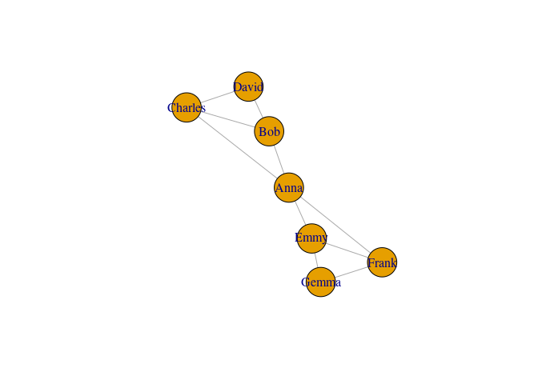
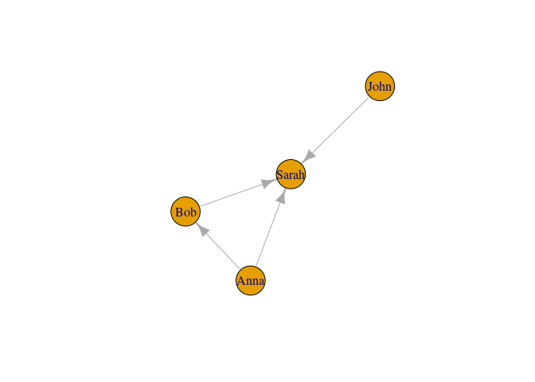
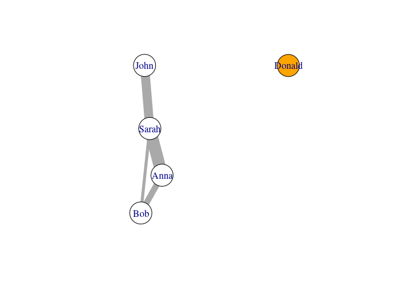
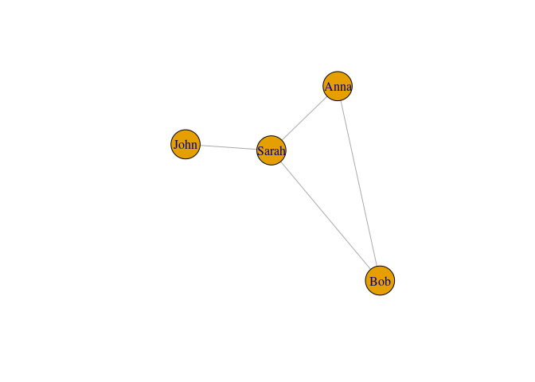
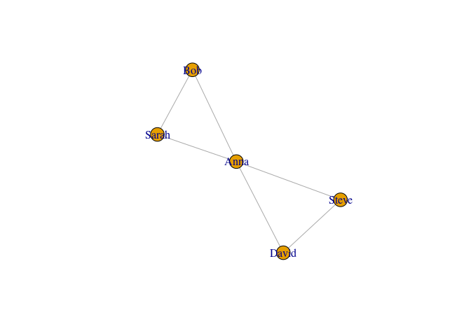
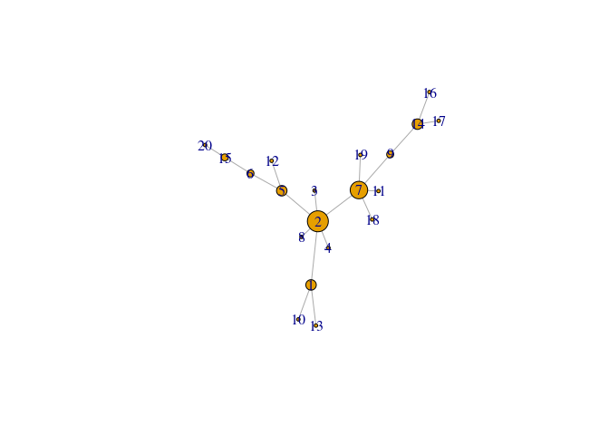
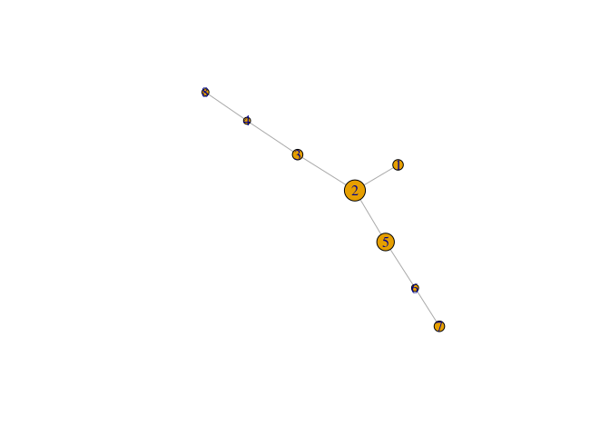

Network data
================
Kasper Welbers
2021-04

  - [Working with network data](#working-with-network-data)
      - [What is network data](#what-is-network-data)
  - [Network data](#network-data)
      - [Network data as an edgelist](#network-data-as-an-edgelist)
          - [From edgelist to igraph](#from-edgelist-to-igraph)
          - [From igraph to edgelist (and
            vertices)](#from-igraph-to-edgelist-and-vertices)
          - [Importing edges and vertices into
            igraph](#importing-edges-and-vertices-into-igraph)
          - [Using attributes in
            visualizations](#using-attributes-in-visualizations)
          - [Using edge attributes to filter
            edges](#using-edge-attributes-to-filter-edges)
          - [Using vertex attributes to filter
            vertices](#using-vertex-attributes-to-filter-vertices)
      - [Network data as a (sparse)
        matrix](#network-data-as-a-sparse-matrix)
          - [A graph as an adjacency
            matrix](#a-graph-as-an-adjacency-matrix)
          - [A graph as a sparse adjacency
            matrix](#a-graph-as-a-sparse-adjacency-matrix)
          - [Did you realize we were basically just
            pivoting?](#did-you-realize-we-were-basically-just-pivoting)
  - [Creating network data by calculating
    adjacency](#creating-network-data-by-calculating-adjacency)
      - [Other examples](#other-examples)
      - [Why using sparse matrices is more than just
        elegant](#why-using-sparse-matrices-is-more-than-just-elegant)
  - [Using network measures](#using-network-measures)
  - [Exporting igraph to Gephi](#exporting-igraph-to-gephi)
      - [Using some format readable by
        Gephi](#using-some-format-readable-by-gephi)
      - [Using a package for specifically creating Gephi files
        (gexf)](#using-a-package-for-specifically-creating-gephi-files-gexf)

# Working with network data

In this tutorial we’ll provide a basic introduction into working with
network data in R. The main goal is to develop some general intuition
for what network data is. We won’t give a detailed introduction about
actual network analysis and visualization, for which there are other
excellent tutorials by [Katya
Ognyanova](https://kateto.net/network-visualization) and [Jesse
Sadler](https://www.jessesadler.com/post/network-analysis-with-r/).
Rather, we focus on the question `what is network data?`, and use this
to consolidate some other perspectives on data that you’ve learned
about. In particular, we focus on how network data can be presented as
both a data.frame and matrix, how the transition between the two is very
similar to what you learned about with pivoting (pivot\_wider,
pivot\_longer), and how this also helps you understand sparse matrices
(such as Document Term Matrices).

We’ll be working with the `igraph` package. This is a powerful package
for text analysis, that besides R is also available in Python,
Mathematica and C++. It should be noted that there are some other
popular alternatives in R, such as the `network` package, and the
combination of `tidygraph` and `ggraph`. The latter in particular makes
a lot of sense to use if you are already familiar with the tidyverse way
of doing things. It should also be noted that `tidygraph` actually uses
the `igraph` package in the background, so it provides the power of the
`igraph` package, but with a more tidyverse style framework. As such,
there is really much to say for `tidygraph`, and the way it uses
`ggraph` for `ggplot2` style visualizations makes it a great package for
working with graphs in R. Yet the reason we do not use it here is that
for learning purposes it’s not always best to view everything through
the tidyverse lens. To get a better grip of working with network data,
we think it’s better to first have a look at the igraph way of doing
things, as a specialized network analysis package. After that, though,
we would encourage you to check out this [excellent tutorial by Jesse
Sadler](https://www.jessesadler.com/post/network-analysis-with-r/) for a
quick demo of tidygraph (which also briefly discusses `network` and
`igraph` for comparison)

## What is network data

We assume that you have already know a bit about network theory, so we
won’t discuss why we need network data in detail, and focus more on how
to work with network data. You’ll see that network data is in many ways
just a different way of representing data that you could just as well
have put in a data.frame or matrix (which in turn can be seen as just
long and wide representations of the same data) But using this different
representation can indeed be very useful. From a substantive point of
view, it helps you think about the data differently. To predict a
person’s political ideology, maybe we shouldn’t just look at
individual level attributes (age, city, education), but also consider
their social network (what is the political ideology of their parents,
friends and colleagues?). To study a person’s power within a community,
maybe we shouldn’t just look at who they are and what function they
hold, but also who they know. This perspective also gives rise to new
types of relevant statistics, such as network centrality.

For example, let’s look at the following matrix. And let’s say that the
values in the matrix represents how often these people talk to each
other.

``` r
m = matrix(c(0,5,0,0,7,0,0,4,0,3,6,0,0,0,1,1,0,1,0,0,0,
             0,4,7,0,0,0,0,3,0,0,0,0,5,7,1,0,0,0,5,0,7,
             0,0,0,0,5,6,0), nrow=7, ncol=7)

rownames(m) = colnames(m) = c('Anna','Bob','Charles','David','Emmy','Frank','Gemma')
m
```

|         | Anna | Bob | Charles | David | Emmy | Frank | Gemma |
| :------ | ---: | --: | ------: | ----: | ---: | ----: | ----: |
| Anna    |    0 |   4 |       1 |     0 |    3 |     1 |     0 |
| Bob     |    5 |   0 |       1 |     4 |    0 |     0 |     0 |
| Charles |    0 |   3 |       0 |     7 |    0 |     0 |     0 |
| David   |    0 |   6 |       1 |     0 |    0 |     0 |     0 |
| Emmy    |    7 |   0 |       0 |     0 |    0 |     5 |     5 |
| Frank   |    0 |   0 |       0 |     0 |    5 |     0 |     6 |
| Gemma   |    0 |   0 |       0 |     0 |    7 |     7 |     0 |

Based on this matrix we could say some relevant things. We can easily
calculate with how many unique people someone talks (degree), and take
into account how many times they talked (weighed degree). We could also
do cluster analysis to discover groups of people that talk often. But if
we’re really interested in relations, we can also represent this exact
same data as a network.

``` r
library(igraph)
g = graph_from_adjacency_matrix(m, mode = 'undirected', weighted = T)
plot(g, vertex.size=30)
```

<!-- -->

The data didn’t change. We just look at it differently. With network
data, visualization can be a very powerful analysis technique, and with
the current network you immediately see some interesting patterns. Most
importantly, there are also some ways in which we could analyze this
data that would not easily have come to mind if we looked at the data as
a matrix. For example, that `Anna` has a high betweenness centrality. We
have two small clusters in the network, and Anna is right in the middle
as the only person connecting them. This position in a network can be
very beneficial. If this would be a network of traders, Anna would be
the only person connecting two markets. If these are scientific
networks, Anna might be the interdisciplinary entrepreneur that combines
the knowledge of two fields. Betweenness centrality measures this
position by counting the number of shortest paths between two nodes in
the network (e.g., Emmy and Bob) that go through Anna. This makes it a
useful measure for things such as gatekeeping power. Without a network
perspective, it would be really hard to explain what this betweenness
centrality measure tells us, and it possibly would never have been
invented.

In this tutorial we’ll focus more on the practical issue of working with
network data. We’ll drive home the point that network data really is
just a different way of representing the same data that you’ve already
worked with. You’ll see that you can structure almost any kind of data
as a network\! And when you do, you can use a vast new array of
techniques from the field of network analysis to study this data from a
different perspective. Off course, you’ll still need to think for
yourself whether this network perspective makes sense for your data. But
being able to switch between different data perspectives also helps you
better understand these different perspectives. In addition, I think
you’ll see that understanding more about network data also helps you
better understand other data structures, in particular long format
data.frames, adjacency matrices, and sparse matrices.

An important thing to keep in the back of your mind throughout this
tutorial is that network theory is not the same as network data. When we
say network data we mostly mean a `graph`, as a mathematical
representation of nodes (or points, vertices) that are related through
edges (or lines, links). Network theory is about the study of actual
networks, such as people that are related through friendships, or
co-citation networks of scholars. There is a close relation between the
two, off course. Concepts such as centrality that aim to measure power
based on network data, are the co-product of social science and graph
theory.

The distinction is important, because you will see many cases where data
is structured as a graph, even though it might not ‘feel’ as a network
to you. While in social network analysis it makes a lot of sense to
study the relations between people as a graph, we might also choose to
present something as a network just because this helps us better analyze
and understand it. For example, similarities (e.g., between words,
between political parties) can be expressed in a heatmap, i.e. a matrix
with colored cells to show which rows and columns are most similar. But
the exact same data can also be presented as a network. In both cases
the data is simply about relations between things, and networks can be
good mental models for thinking about relations. In yet other cases,
there can be mostly technical reasons for storing data in a network
format. See for instance the [Resource Description
Framework](https://www.w3.org/RDF/) (RDF).

Therefore, the focus of this tutorial will mainly be to show how
different data formats are related to network data. We’ll mostly just
play around with data to make you see this.

# Network data

Network data has two main components: `nodes` and `edges`. If you think
of a social network, the `nodes` are the people, and the `edges` are the
relations between people. But these nodes and edges can be virtually
anything, as long as the `edges` describe some sort of relations between
`nodes`. For example, consider words and their semantic relations,
websites and the links between them, or the nodes and weighted relations
in a neural network. A distinction is made between `undirected` and
`directed` edges, and typically this distinction is made at the level of
the whole network (so all edges are either directed or undirected).

As usual, there is some difference in terminology between fields. You
probably noticed that we talk of both `graphs` and `networks`. Often you
can simply think of these as identical, though perhaps more accurately
the `graph` is the mathematical structure for relations between objects,
and this turns out to be great for studying `networks`. Instead of
`nodes`, some people use `vertices` or `points`. Instead of `edges`,
some people use `ties`, `links` or `lines`. Sometimes a distinction is
made between `arcs` and `edges`, to refer to `directed` and `undirected`
edges, respectively. In `igraph`, they use `vertices` and `edges`, so
that’s what we’ll be using here as well.

## Network data as an edgelist

Let’s start out with a very simple network, that we’ll arrange in an
`edgelist` format. As the name implies, this is just a list of edges. By
`list`, we now mean the more everyday meaning, and not the specific
`list()` class in R. An `edgelist` in R is instead simply a
`data.frame`, in which each row represents an `edge`. For example,
consider the following edgelist of people that are friends.

``` r
el = data.frame(from = c("Anna", "Anna", "Bob", "John"),
                to = c("Bob","Sarah","Sarah","Sarah"))
el
```

| from | to    |
| :--- | :---- |
| Anna | Bob   |
| Anna | Sarah |
| Bob  | Sarah |
| John | Sarah |

This provides the bare minimum of information for a network. We have 3
edges, that only tell us that some sort of relation exists between (1)
Anna and Bob, (2) Anna and Sarah, (3) Bob and Sarah and (4) John and
Sarah. Although we don’t have any data about the `vertices`, we can
already determine that in this network we must have vertices for `Anna`,
`Bob`, `John` and `Sarah`.

### From edgelist to igraph

Let’s first see what `igraph` does when we create a network based on
this `edgelist`. To do so, we use the function `graph_from_data_frame`.
As explained in the documentation, the input for this function should
be:

> A data frame containing a symbolic edge list in the first two columns.
> Additional columns are considered as edge attributes.

So in our case, the first columns (`from` and `to`) are seen as the
edgelist, and since we don’t have additional columns, we should just get
a network for this edgelist.

``` r
library(igraph)
g = graph_from_data_frame(el)
g
```

    ## IGRAPH 0b1e2c2 DN-- 4 4 -- 
    ## + attr: name (v/c)
    ## + edges from 0b1e2c2 (vertex names):
    ## [1] Anna->Bob   Anna->Sarah Bob ->Sarah John->Sarah

We have now created the network. The print information for `g` is a bit
ugly, but the `DN-- 4 4 --` part tells us that we have a `directed
network` (DN) with 4 vertices and 4 edges.

We can get a better idea by plotting the network. For this we can use
the regular `plot` method. We only added the `vertex.size` argument to
make the vertices a bit bigger (so that the words fit)

``` r
plot(g, vertex.size=30)
```

<!-- -->

The visualization shows a `directed` network, with indeed the four edges
that we defined.

Note that our data never said that our network is directed. It could
well be that we actually know that these edges are undirected. So, it’s
not the case that John is friends with Sarah, but Sarah is not friends
with John. Indeed, you need to tell `igraph` whether your edgelist is
directed or not.

``` r
g = graph_from_data_frame(el, directed = F)
plot(g, vertex.size=30)
```

<!-- -->

Now the `g` print would read `UN-- 4 4 --`, indicating an undirected
network (UN). In the visualization we also see that the arrows are gone.

### From igraph to edgelist (and vertices)

Now, let’s convert the igraph network back to data.frames, to get a
better idea of how `igraph` now *sees* this data. For this we use the
`as_data_frame` function. We set the `what` argument to both, so that we
get both the `edges` AND the vertices. Note that we also use the prefix
`igraph::`. It’s not strictly necessary here, but it turns out that the
`as_data_frame` function name is also used by `dplyr`. So now we
explicitly tell R that we want to use the `as_data_frame` function from
the `igraph` package.

``` r
igraph::as_data_frame(g, what='both')
```

    ## $vertices
    ##        name
    ## Anna   Anna
    ## Bob     Bob
    ## John   John
    ## Sarah Sarah
    ## 
    ## $edges
    ##   from    to
    ## 1 Anna   Bob
    ## 2 Anna Sarah
    ## 3  Bob Sarah
    ## 4 John Sarah

Lo and behold\! Our `edgelist` input has returned, but now in addition
we get a `vertices` data.frame. We wanted to show you this, because once
we create the network, we no longer have `just an edgelist`. The
`vertices` and `edges` are two separate parts of the network. This is
important, because THERE MIGHT BE VERTICES WITHOUT EDGES\!

Imagine the following sad scenario. In the data we collected, we also
included Donald (completely random name). But Donald did not have any
friends :’(, and so while Donald was in our `vertices` data, he did not
end up in our edgelist. So let’s solve this in the next section.

### Importing edges and vertices into igraph

Now let’s more properly import both vertices and edges. This time we’ll
need two data.frames. Also, this time we’ll add some extra vertex and
edge attributes.

``` r
el = data.frame(from = c("Anna", "Anna", "Bob", "John"),
                to = c("Bob","Sarah","Sarah","Sarah"),
                weight = c(10,20,5,15),
                friends_since = c(2018,2010,2020,2020))

v  = data.frame(name = c("Anna","Bob","John","Sarah","Donald"),
                age = c(22,25,21,30,74),
                skincolor = c("white","white","white","white","orange"))
```

Notice that I labeled one edge attribute “weight”. This is common,
because typically an edge also has a weight to it. In this case, weight
might be a friendship score.

``` r
g = graph_from_data_frame(el, vertices = v, directed = FALSE)
```

So this time we passed both the edgelist (el) and vertices (v) to
`graph_from_data_frame`. Notice that we never told `igraph` how the
vertices and edgelist are related. This is implicit.

  - The first two columns of the `el` data.frame are taken to be the
    edgelist, and the values in this edgelist become the unique `name`
    of the nodes.
  - The first column of the `v` data.frame should hold values that match
    these unique names.

<!-- end list -->

``` r
plot(g, vertex.size=30)
```

<!-- -->

Now our network does include Donald, even though he’s still excluded by
his social alters. Also,

### Using attributes in visualizations

Our network now also contains the additional vertex and edge attributes.
We won’t discuss how to use these in detail, because this is already
greatly done by [Katya
Ognyanova](https://kateto.net/network-visualization). Also, you might
just want to create the data in R and then export it to Gephi, for which
we provide instructions below. But here’s a simple example of how we use
the edge attributes (`E(g)$weight`) and vertex attributes
(`V(g)$skincolor`) to set visualization parameters.

``` r
plot(g, vertex.size=30, edge.width=E(g)$weight, vertex.color=V(g)$skincolor)
```

<!-- -->

### Using edge attributes to filter edges

Attributes can also be used to filter the data. There is a bit of a
trick to this in igraph. You can delete edges, but to do so you must
provide the `indices` of the edges to delete. The trick then is that you
can use an expression for an edge attribute to create a logical vector
of edges to remove:

``` r
E(g)$weight < 10
```

    ## [1] FALSE FALSE  TRUE FALSE

But you need to wrap it in `which()`, which will convert this logical
vector to a vector giving the positions that are TRUE.

``` r
which(E(g)$weight < 10)
```

    ## [1] 3

Now you can use this to filter edges

``` r
rm_edge_indices = which(E(g)$weight < 10)
gs = delete_edges(g, rm_edge_indices)
plot(gs, vertex.size=30)
```

<!-- -->

### Using vertex attributes to filter vertices

The same approach also works for deleting vertices.

``` r
rm_vertex_indices = which(V(g)$skincolor == 'orange')
gs = delete_vertices(g, rm_vertex_indices)
plot(gs, vertex.size=30)
```

<!-- -->

## Network data as a (sparse) matrix

As you have now seen, you can basically just think of network data as
two data.frames, where one contains the `vertices` (or nodes) and one
contains the `edges`. If you’re just interested in working with network
data, this might be all you need. And if so, then probably the
`tidygraph` package is the best way to go.

But the purpose of this tutorial is to give a more general overview of
what network data is. And one very important realization about network
data is that it also makes sense to think of network data as a matrix.
This is because network data is often about some form of adjacency
(closeness) between vertices. This can be some form of being close on a
social level (e.g., friendship, communicate often), or close in terms of
power (e.g., who is the boss of whom, who influences whom). If vertices
are words, they can be close in terms of their semantic meaning, which
might even be directly measured based on how often they occur close
together in documents.

So why does this have anything to do with matrices? Well, matrices are
just very nice data structures to do calculations. Many of the useful
operations and statistics that we use in network analysis are based on
matrix algebra.

So maybe you don’t need to know this if you just want to do some network
analysis without thinking about it too much. But taking some time to
appreciate the relation between edgelists and matrices does help you
better understand both networks and matrices (and overall make you a
better person).

### A graph as an adjacency matrix

Above we created a network `g` from an edgelist. We can now extract *a
part of* the same data as an adjacency matrix. This is a square matrix
in which all the vertices are in the rows and columns, and the cells
indicate the strength of the edge.

``` r
a = as_adjacency_matrix(g, attr='weight')
a
```

    ## 5 x 5 sparse Matrix of class "dgCMatrix"
    ##        Anna Bob John Sarah Donald
    ## Anna      .  10    .    20      .
    ## Bob      10   .    .     5      .
    ## John      .   .    .    15      .
    ## Sarah    20   5   15     .      .
    ## Donald    .   .    .     .      .

The result is a sparse matrix. This means that all the values in the
matrix that are 0 are empty (we’ll get back to this later). Here we see
that there is an edge between Anna and Bob with a value of 10. Since the
matrix is undirected, this edge appears twice (from Anna to Bob and Bob
to Anna).

You can also create an igraph object based on an adjacency matrix. Here
we recreate `g` (now named `g2`) based on `a`. Note that we need to
specify that the graph is undirected, and that the values need to be
interpreted as weights.

``` r
g2 = graph_from_adjacency_matrix(a, mode = 'undirected', weighted = T)
g2
```

    ## IGRAPH 5d3734d UNW- 5 4 -- 
    ## + attr: name (v/c), weight (e/n)
    ## + edges from 5d3734d (vertex names):
    ## [1] Anna--Bob   Anna--Sarah Bob --Sarah John--Sarah

Creating a network from an adjacency matrix is very useful, because it
means that we can create a network out of anything for which we can
create an adjacency matrix. And, as we’ll show later on, you can create
an adjacency matrix from basically any matrix.

But before we go there, note that an annoying thing about creating a
graph from an adjacency matrix is that it can’t handle vertex
attributes, and only one edge attribute. So in our little conversion
dance from `g` to `a` to `g2` we lost these attributes:

``` r
igraph::as_data_frame(g2, 'both')
```

    ## $vertices
    ##          name
    ## Anna     Anna
    ## Bob       Bob
    ## John     John
    ## Sarah   Sarah
    ## Donald Donald
    ## 
    ## $edges
    ##   from    to weight
    ## 1 Anna   Bob     10
    ## 2 Anna Sarah     20
    ## 3  Bob Sarah      5
    ## 4 John Sarah     15

So whenever you use `graph_from_adjacency_matrix`, you’ll need to set
the attributes afterwards. This is not super hard (there are the
`set_vertex_attr` and `set_edge_attr` functions), but it is a bit
annoying. Alternatively, the following section shows that you can also
convert a sparse adjacency matrix to an edgelist. Then you can tidy it
together with whatever data you have, and simply use the
`graph_from_data_frame` function.

### A graph as a sparse adjacency matrix

The adjacency matrix `a` is a sparse matrix. This is a good point to
talk a bit about what a sparse matrix is. Firstly, because it helps you
understand why we can quite easily convert network data in an adjacency
matrix to an edgelist. Secondly, because the mental image of a network
can actually help you better understand what a sparse matrix is, and
sparse matrices are really usefull to know about.

A sparse matrix is a special type of matrix that is designed so that it
doesn’t actually store cells where the value is zero. This is super
important for network data (another example of where this is critical is
a Document Term Matrix). If you have a network of 1,000,000 people, and
each person has an edge with about 50 people in this network, then you
only need to store 50,000,000 edges. But if you would try to put this in
a regular matrix, you would create 1,000,000,000,000 cells (1,000,000
rows by 1,000,000 columns)

So how does a sparse matrix just ignore the cells with a value of 0? A
sparse matrix shares some common ground with an edgelist. Notice that an
edgelist can be seen as giving the coordinates of an adjacency matrix.
The edge `Anna` -\> `Bob` is located where `Anna's row` and `Bob's
column` intersect. A sparse matrix provides a smart way to store the
locations of non-zero cells, and then only provide the values for these
cells. Also, sparse matrices use special matrix algebra that makes
certain calculations super fast, including a nice way to create an
adjacency matrix (that we’ll show in a minute).

One sparse matrix format, called `dgTMatrix` in the Matrix package, is
pretty much identical to an edgelist, and we can hack this a little bit
to convert the sparse matrix to an edgelist.

``` r
library(Matrix)
a2 = as(a, 'dgTMatrix')    ## convert to dgTMatrix
```

This class has `i` and `j` slots that contain the row and column
indices, and an `x` slot with the values.

``` r
data.frame(from = a2@i, to = a2@j, x = a2@x)
```

| from | to |  x |
| ---: | -: | -: |
|    1 |  0 | 10 |
|    3 |  0 | 20 |
|    0 |  1 | 10 |
|    3 |  1 |  5 |
|    3 |  2 | 15 |
|    0 |  3 | 20 |
|    1 |  3 |  5 |
|    2 |  3 | 15 |

Note that accessing slots (with @) is hacky, because we’re directly
accessing internal data in the class that is not directly meant to be
used. We also need to add 1 to these indices, because these indices
start at 0, which is common in many programming languages (so these
indices are not actually meant to be used in R). But when we hack our
indices together like this, we can use them to get the vertex names from
the row/column names of the matrix, to create the edgelist.

``` r
data.frame(from = rownames(a)[a2@i+1], to = colnames(a)[a2@j+1], weight = a2@x)
```

| from  | to    | weight |
| :---- | :---- | -----: |
| Bob   | Anna  |     10 |
| Sarah | Anna  |     20 |
| Anna  | Bob   |     10 |
| Sarah | Bob   |      5 |
| Sarah | John  |     15 |
| Anna  | Sarah |     20 |
| Bob   | Sarah |      5 |
| John  | Sarah |     15 |

One final touch is that for undirected data we could ignore half of the
edges. This corresponds to only using the upper or lower triangle of the
matrix. We can extract this part using the `triu` (tri-upper) function
from the Matrix package.

``` r
a2 = triu(a2)
data.frame(from = rownames(a)[a2@i+1], to = colnames(a)[a2@j+1], weight = a2@x)
```

| from | to    | weight |
| :--- | :---- | -----: |
| Anna | Bob   |     10 |
| Anna | Sarah |     20 |
| Bob  | Sarah |      5 |
| John | Sarah |     15 |

In summary, edge lists and sparse matrices are pretty similar, and we
can (with some creativity) convert between them. This is not just a fun
fact, but can be very useful when you are creating network data. As
shown in the next section, you can use matrix algebra to create an
adjacency matrix for many types of data.

#### lifehack

You could also actually abuse `igraph` to convert an adjacency matrix to
an edgelist. Simply create the graph with `graph_from_adjacency_matric`,
and then extract the edgelist with `as_data_frame`.

### Did you realize we were basically just pivoting?

It can be useful to realize that in the previous section, we basically
pivoted from wide to long format. We don’t want to make a big thing out
of this, but thinking on this might help you develop a better intuition
for the relation between edgelists and long formats, matrices and wide
formats, and network data.

# Creating network data by calculating adjacency

Now that we’ve discussed quite in detail what network data is, let’s
discuss some ways to create network data. Off course, ideally we would
have data that was specifically collected for network analysis, but
collecting network data is super hard. Instead, you often see that
network data is extracted from other data that can tell us something
about relations.

In particular, network data can be created if we have data that can tell
us something about the adjacency, or similarity, of certain objects. A
good example is the use of bibliographic records. A lot of (early)
network analysis uses co-publication networks in science. For example,
you could have data like this.

``` r
bib = data.frame(DOI = c(1, 1, 1, 2, 2, 3, 3, 3),
                 author = c('Bob', 'Sarah', 'Anna', 'Sarah', 
                            'Anna', 'Anna','Steve','David'))
```

Now, we could say that we define a network relation based on the number
of articles that authors co-authored. We could write a simple loop that
counts this. However, this is another case where matrices shine. Because
what we want to do is to create an adjacency matrix representation of
our network, and we can create an adjacency matrix by taking the inner
product of almost any matrix.

So let’s first restructure our bib data into a matrix format. Here we
also use a sparse matrix format, because a large matrix of authors and
articles will be very sparse (i.e. each article will only have been
authored by a very small number of all authors). We’ll do this in nice
simple steps to make it clear that what we’re doing is quite
straightforward.

``` r
## we first get the unique values in DOI and author
doi = unique(bib$DOI)
author = unique(bib$author)

## these are the rows and columns of our matrix. So now we get the
## indices of the values for these rows and columns.
i = match(bib$DOI, doi)
j = match(bib$author, author)

## create the matrix. 
## (note that if we have weights we could pass them to x)
bib_m = sparseMatrix(i, j, x=1, dimnames=list(doi, author))
bib_m
```

    ## 3 x 5 sparse Matrix of class "dgCMatrix"
    ##   Bob Sarah Anna Steve David
    ## 1   1     1    1     .     .
    ## 2   .     1    1     .     .
    ## 3   .     .    1     1     1

Now we can calculate the inner product of this matrix to see how often
author were co-authors. Without going into detail on matrix algebra,
this creates a matrix in which the authors are in the rows and columns,
and the cells give the dot product of the author vectors. So for
example, for Bob and Sarah, the dot product is:

``` r
bob = bib_m[,'Bob']
sarah = bib_m[,'Sarah']
sum(bob * sarah)
```

    ## [1] 1

The inner product gives us these dot products for all combinations of
authors. To calculate the inner product we use the special `crossprod`
function, because this is optimized for sparse matrices (which is
insanely fast, as we show later).

``` r
cp = crossprod(bib_m)
cp
```

    ## 5 x 5 sparse Matrix of class "dsCMatrix"
    ##       Bob Sarah Anna Steve David
    ## Bob     1     1    1     .     .
    ## Sarah   1     2    2     .     .
    ## Anna    1     2    3     1     1
    ## Steve   .     .    1     1     1
    ## David   .     .    1     1     1

Now we can create the graph. Note that our data is undirected, and has
weights. Also, we use `diag = F` to state that we don’t want to include
the diagonal, which contains the times that an author co-authored with
oneself. In a network these can be included as edges to oneself (loops),
but here that wouldn’t make sense (it could for instance make sense in
citation networks).

``` r
bib_g = graph_from_adjacency_matrix(cp, mode = 'undirected', weighted = T, diag = F)
plot(bib_g)
```

<!-- -->

## Other examples

Another example, if you are familiar with Document Term Matrices, is
that we can calculate the similarity of documents or terms. If we
calculate the inner product of a DTM, we get an adjacency matrix of the
terms. This can tell us how often terms co-occurred, or be used to
calculate the cosine similarity of terms. This is a common approach in
some branch of semantic network analysis. You can even employ network
clustering techniques to get results similar to topic modeling.

If we first transpose the DTM and then calculate the inner product, we
get an adjacency matrix of documents. This can for instance be used to
find clusters of very similar documents, to find documents that have the
same topic, cover the same event, or to detect plagiarism.

## Why using sparse matrices is more than just elegant

You might still be on the fence about why we need matrices at all. Sure,
it’s an elegant way to process this type of data, but does it also have
practical benefit? And the answer is yes: it’s insanely fast. People
have thought long and hard about how to do matrix stuff as fast as
possible. If you realize that your data can be represented as a matrix
(without much overhead costs), you’ll want to make use of this.

But this is better shown than told. Here we create a random sparse
matrix with the convenient `rsparsematrix` function. The matrix has
1000000 rows, 10000 columns, and 10000 non-zero values in random
locations.

``` r
library(Matrix)
m = rsparsematrix(nrow = 1000000, ncol = 10000, nnz = 10000)
format(object.size(m), 'Mb')
```

    ## [1] "0.2 Mb"

So despite having 10000000000 cells, it only costs us 0.2 Mb, because we
only need to store those 10000 non zero values (and their locations).

This would already have been fun if it just saved us some memory, but
the really cool part is that sparse matrices also have specialized
operations. For example, let’s do some matrix multiplication and
calculate the inner product. In a regular matrix, this operation is
equivalent to calculating the dot product of all combinations of
columns. If this were a dense matrix, this would mean that we have 10000
\* 10000 combinations, and for each combination we would need to
multiply two vectors of 1000000 elements and take the sum. Even for a
computer, this would take a loooong time (and many computer wouldn’t
even be able to keep the dense matrix in memory\!). For sparse matrices,
there are techniques that require us to only compute the products of two
non-zero values. So how long does it take to compute the inner product?
Let’s just run a benchmark where we compute it 100 times and check the
average speed.

``` r
library(microbenchmark)
microbenchmark(cp = crossprod(m), times = 100, unit = 's')
```

On my computer, the average speed is 0.004 seconds\! So when we showed
above that you can use matrix multiplication to create network data, we
weren’t just suggesting a mathematical approach because it’s so nice and
elegant. It’s nice, elegant, and insanely fast.

# Using network measures

We haven’t even talked about network measures\! But really, if you know
what measure to use, you can just search it on the extensive [igraph
documentation page](https://igraph.org/r/doc/). If you know R, there is
little magic here. But one thing that is good to show is how you might
add network statistics to your network data. This allows you to do thing
such as filtering and visualizing on network statistics. Also, it let’s
you export whatever you do in R to any program you might use later on.

Let’s first sample a random network to get some data.

``` r
gr = ba.game(20, 1, directed=F)
plot(gr)
```

<!-- -->

Now we take a simple statistic, but you can do the following with any
statistic that gives values per vertex. We can calculate the degree of
vertices with the `degree` function.

``` r
degree(gr)
```

    ##  [1] 3 6 1 1 3 2 5 1 2 1 1 1 1 3 2 1 1 1 1 1

This returns a vector of values, so we can directly just assign this
vector to our vertices as an attribute.

``` r
V(gr)$degree = degree(gr)
plot(gr, vertex.size = V(gr)$degree * 3)
```

<!-- -->

Not pretty, but you get the idea. We can now also filter out vertices
below a certain degree.

``` r
grs = delete_vertices(gr, which(V(gr)$degree <= 1))
plot(grs, vertex.size = V(grs)$degree * 3)
```

<!-- -->

Note that the degree is still based on the previous degree calculation
(before filtering).

Next to statistics we could also cluster the data. There are various
cluster algorithms (see the documentation for functions starting with
`cluster_`). Here we’ll use a simple and fast method.

``` r
cl = cluster_fast_greedy(gr)
cl$membership
```

    ##  [1] 5 3 3 3 1 1 4 3 2 5 4 1 5 2 1 2 2 4 4 1

Among the output is the `membership` vector, which is a vector with the
cluster ids to which each vertex is assigned. You could for instance use
this to color vertices.

``` r
## first get a vector with colors. we need as many as we have clusters
colors = rainbow(max(cl$membership))

## the $membership vector gives cluster ids from 1 to max(cl$membership), so
## we can just use the membership value to select a color.
plot(gr, vertex.color = colors[cl$membership])
```

<!-- -->

And off course, we can assign the cluster membership id as a vertex
attributes.

``` r
V(gr)$cluster = cl$membership
```

And to conclude, note that you can now also export everything back to a
data.frame.

``` r
vertices_with_attr = igraph::as_data_frame(gr, 'vertices')
head(vertices_with_attr)
```

| degree | cluster |
| -----: | ------: |
|      3 |       5 |
|      6 |       3 |
|      1 |       3 |
|      1 |       3 |
|      3 |       1 |
|      2 |       1 |

This brings us full circle, because you can now also use igraph as a way
to compute relevant network statistics, that you can then use as you
would use any variables in your analysis.

# Exporting igraph to Gephi

Maybe you’re just here to see how to transform your data into a format
that’s readable by Gephi, so that you can do all the analysis stuff
there.

## Using some format readable by Gephi

Igraph does not out-of-the-box export to the specific Gephi format, but
it does export to formats that Gephi should be able to import, such as
grapml. But some stuff might get lost in translation (well, not lost,
but you might have to clean it up a bit).

``` r
write_graph(g, file='mygraph.graphml', format = 'graphml')
```

## Using a package for specifically creating Gephi files (gexf)

There are packages for creating a file readable by Gephi. We found one
CRAN package called
[rgexf](https://cran.r-project.org/web/packages/rgexf/vignettes/rgexf.html)
that says to create the gexf file, but it’s not very well made, and
didn’t work on Linux (but maybe you’re lucky)

``` r
library(rgexf)   ## install.packages('rgexf')
?igraph.to.gexf(igraph.obj = g)
```

We had more luck with the [gephi](http://rmhogervorst.nl/gephi/)
package, that simply writes the files to the correct csv format that
“gephi likes”. This packages is not on CRAN though, so you’ll have to
install it via github.

``` r
library(gephi)  ## devtools::install_github('RMHogervorst/gephi')
gephi_write_edges(graphexample, "youredges.csv")
gephi_write_nodes(graphexample, 'yournodes.csv')
```
